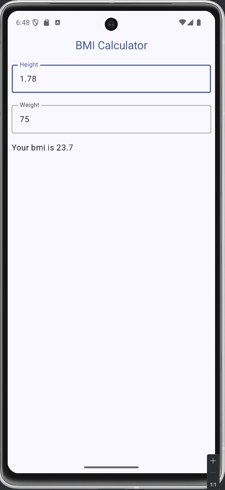

# Native technologies in Mobile Programming

**Exercise. Body mass index using ViewModel**
> Implement Android app with Kotlin and Compose, which calculates body mass index
based on person’s height and weight. Formula for calculating bmi is weight / (height *
height). In this exercise a ViewModel class should be used to hold all necessary
information (member variables) and operations (methods).

## App image

